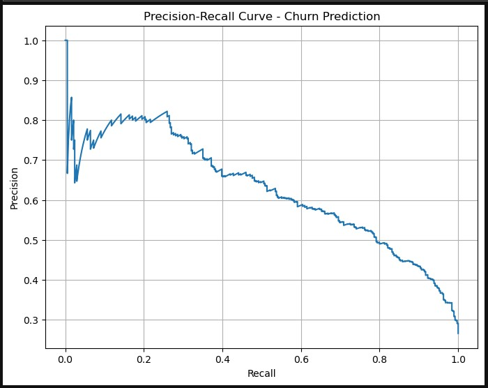

# Customer Churn Prediction with Machine Learning

## Overview
In this project, I built and compared two machine learning models to predict customer churn — one with Logistic Regression and one with Random Forest. The idea was to figure out which customers are likely to leave a service and what we can do about it. I also tuned the models, especially the Random Forest one, to get better performance and more useful business insights.

## Business Goal
The goal here is to help a company stop losing customers. By predicting who might churn, the business can take action early — like offering discounts or improving support — instead of reacting after it's too late.

---

## Models and Results

| Metric                | Logistic Regression | Random Forest (Tuned) |
|-----------------------|---------------------|------------------------|
| Accuracy              | 73%                 | 75%                    |
| Recall (Churn)        | **79%**             | 71%                    |
| Precision (Churn)     | 50%                 | **52%**                |
| ROC-AUC               | 0.83                | 0.83                   |

The Random Forest model did a better job at precision, but the Logistic Regression model was stronger on recall, which means it was better at catching churners. After tuning, the Random Forest model got more balanced while keeping the overall AUC solid.

---

## Visuals

### Logistic Regression Evaluation

  
*The ROC curve for Logistic Regression shows strong separation with an AUC of 0.83. This means the model does a solid job distinguishing between churners and non-churners.*

  
*Precision stays decent in the mid-recall range, making this model a good choice if your priority is catching as many churners as possible.*

---

### Random Forest (Tuned) Evaluation

  
*Random Forest hits the same AUC (0.83) but with a different balance — it’s more conservative in predicting churn, which lowers false positives.*

  
*This curve confirms that Random Forest is more precise, though it misses a few more actual churners than Logistic Regression.*

---

### Feature Importance

  
*According to the Random Forest model, the biggest churn signals are total charges, monthly charges, tenure, and whether the customer is on a long-term contract.*

---

## Tools and Techniques Used
- Python
- Pandas & NumPy for data work
- Matplotlib & Seaborn for visualizations
- Scikit-learn for modeling, evaluation, and tuning
- GridSearchCV for Random Forest optimization
- Balanced class weights to deal with the churn/no-churn imbalance

---

## Key Insights
- Customers with high total and monthly charges and short tenure are the most likely to churn.
- Two-year contracts are a strong sign someone’s going to stick around.
- Fiber optic service came up a lot — probably because of pricing or service quality.
- These results suggest businesses could:
  - Offer discounts or support to new or high-cost users
  - Push longer-term contracts
  - Focus retention efforts on short-tenure, high-spend customers

---

## How to Run This

To use the Customer Churn Prediction App, just open it in your browser — no installation required:

👉 **[Launch the App](https://your-streamlit-app-link.streamlit.app)**

> Use the app to test different machine learning models and predict whether a customer is likely to churn based on their service details.

<details>
  <summary>Prefer to run it locally? Follow these steps:</summary>

1. **Clone the repository:**
   ```bash
   git clone https://github.com/enagelkirk/ML-Churn-Prediction.git
   cd ML-Churn-Prediction

2. **(Optional but recommended) Create a virtual environment:**

   ```bash
   python -m venv venv
   source venv/bin/activate  # On Windows: venv\Scripts\activate

3. **Install the required dependencies:**

   ```bash
   pip install -r requirements.txt

4. **Run the app:**

   ```bash
   streamlit run streamlit_app.py

</details>
